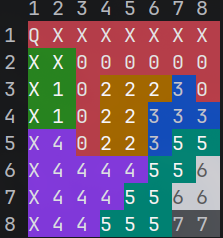

# Queens Solver

A Java CLI game based on the [Queens puzzle](https://www.playqueensgame.com/) — place one queen per row, column, and color region, with no two queens touching (even diagonally).

Puzzles are scraped from [playqueensgame.com](https://www.playqueensgame.com) and solved using a backtracking algorithm. The board renders in color in your terminal.

## Prerequisites

- **Java 25+** — check with `java --version`
- **Google Chrome** — required for the `fetch-database` command (Selenium drives it automatically)

## Setup

```bash
git clone git@github.com:Lai-es/queens-solver-java.git
cd queens-solver
```

## Usage

### Fetch puzzle database
Downloads up to 300 8×8 puzzles and saves them to `./puzzles/8x8/`:
```bash
./gradlew run --args="fetch-database"
```
> Ideomatically, run this once before using `solve-random`. But theres also a puzzle database uploaded.

### Play a random puzzle
```bash
./gradlew run --args="solve-random"
```
The board is displayed with color-coded regions. Enter moves as `rowcol` (e.g. `11` for row 1, column 1).

| Input       | Action                                                  |
|-------------|---------------------------------------------------------|
| `11`        | Place a queen at row 1, col 1                           |
| `r11` `R11` | Remove the queen at position 11                         |
| `x11` `X11` | Set/Unset a mark (where no queen can be) at position 11 |
| `solve`     | Reveal the solution instantly                           |
| `help`      | Prints the Rules                                        |
| `reset`     | Resets the current puzzle                               |
| `tip`       | Gives a tip based on the current game state             |

Cells in the same row, column, color region or adjacent to a placed queen are marked with `X`. The time since beginning the puzzle is displayed.
If the game is finished, the user has the option to play another one.

Example output:



## Project structure

```
queens-solver/
└── app/src/main/java/com/queens/
    ├── Main.java                        # CLI entry point
    ├── model/
    │   ├── Board.java                   # grid + color region map
    │   └── Queen.java                   # position (row, col)
    ├── solver/
    │   └── BacktrackingSolver.java      # recursive backtracking algorithm
    ├── validator/
    │   └── PlacementValidator.java      # constraint checker
    └── io/
        ├── QueensFetcher.java           # Selenium-based puzzle downloader
        ├── PuzzleParser.java            # reads puzzle files into Board
        ├── BoardPrinter.java            # colored terminal output
        └── UserSolve.java               # interactive game loop
```

## Rules

1. Each **row** must contain exactly one queen
2. Each **column** must contain exactly one queen
3. Each **color region** must contain exactly one queen
4. No two queens may **touch** — not even diagonally

# Why am i doing this?

- to learn how gradle projects are structured
- to recap recursion
- to learn how Webscrapers work and use one for the first time
- to build my first java app